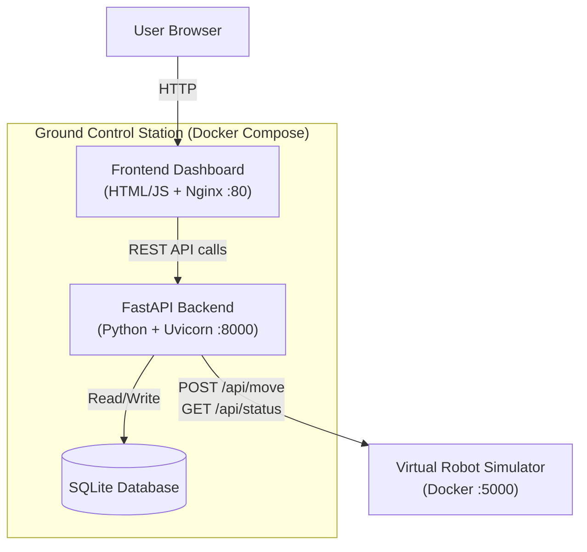

# System Architecture — Ground Control Station (GCS)

## 1. Architectural Pattern

The Ground Control Station follows a **Layered Architecture** pattern, 
organised into three distinct layers:
┌─────────────────────────────────────┐
│         Presentation Layer          │
│   HTML/CSS/JS Dashboard (Nginx)     │
├─────────────────────────────────────┤
│         Application Layer           │
│   FastAPI Backend (Python/Uvicorn)  │
├─────────────────────────────────────┤
│           Data Layer                │
│   SQLite Database + Robot API       │
└─────────────────────────────────────┘
- **Presentation Layer**: A single-page HTML/CSS/JavaScript dashboard served 
  by Nginx. Handles all user interaction, login, robot grid visualisation, 
  and mission log display.
- **Application Layer**: A FastAPI (Python) backend handling authentication, 
  RBAC enforcement, and proxying commands to the Virtual Robot API.
- **Data Layer**: SQLite database storing users and mission logs. The Virtual 
  Robot REST API acts as an external data source for live telemetry.

## 2. Design Patterns Applied

### Facade Pattern
`robot_client.py` implements the **Facade Pattern**. It hides the complexity 
of raw HTTP requests, JSON parsing, timeout handling, and error management 
behind clean, simple methods:
- `get_status()` — fetches robot telemetry
- `move(x, y)` — sends a move command
- `reset()` — resets robot position

Without this facade, every route in `main.py` would need to handle HTTP 
headers, timeouts, and error parsing directly — creating duplication and 
fragile code.

### Singleton Pattern
The `robot` object at the bottom of `robot_client.py` implements the 
**Singleton Pattern**:
```python
robot = RobotClient()
```
Only one instance of `RobotClient` is created and shared across the entire 
application. This ensures a single, consistent connection manager handles 
all robot communication, preventing resource conflicts.

### Layered Security Pattern
Authentication and authorisation are implemented as distinct layers:
1. Token verification (`verify_token`) — is the user authenticated?
2. Role check (`user["role"] == "commander"`) — are they authorised?
3. Mission logging — every command is recorded regardless of outcome

## 3. Tech Stack

| Component | Technology | Purpose |
|---|---|---|
| Frontend | HTML/CSS/JavaScript | User interface |
| Web Server | Nginx | Serves static frontend files |
| Backend API | FastAPI (Python) | REST API, RBAC, business logic |
| ASGI Server | Uvicorn | Runs FastAPI in production |
| Database | SQLite | User accounts and mission logs |
| HTTP Client | httpx | Async requests to robot API |
| Containerisation | Docker + Docker Compose | Multi-container orchestration |
| CI/CD | GitHub Actions | Automated testing and delivery |
| Testing | pytest + pytest-cov | Unit and integration tests |

## 4. Open-Source License Audit

| Library | Purpose | License | Type |
|---|---|---|---|
| FastAPI | Web framework | MIT | Permissive |
| Uvicorn | ASGI server | BSD | Permissive |
| httpx | HTTP client | BSD | Permissive |
| pytest | Testing framework | MIT | Permissive |
| Nginx | Web server | BSD | Permissive |
| Python | Language runtime | PSF | Permissive |

**Conclusion**: All dependencies use permissive licenses (MIT, BSD, PSF). 
There are no Copyleft (GPL) dependencies, meaning the Ground Control Station 
codebase has no legal obligation to be made open-source.

## 5. CBSE Interface Specification — Mission Logger

The Mission Logger is treated as an independent **Component-Based Software 
Engineering (CBSE)** component.

**Provides Interface** (services it exposes):
- `logCommand(username, action, details, result)` — records a command to the DB
- `getLogs(limit)` — retrieves recent mission log entries
- `exportLogs()` — exports logs for auditing

**Requires Interface** (external services it depends on):
- Database Connection (SQLite via `get_connection()`)
- System Clock / Timestamp Service (`datetime.utcnow()`)
- Authentication Service (to verify the requesting user's identity)

## 6. System Component Diagram

