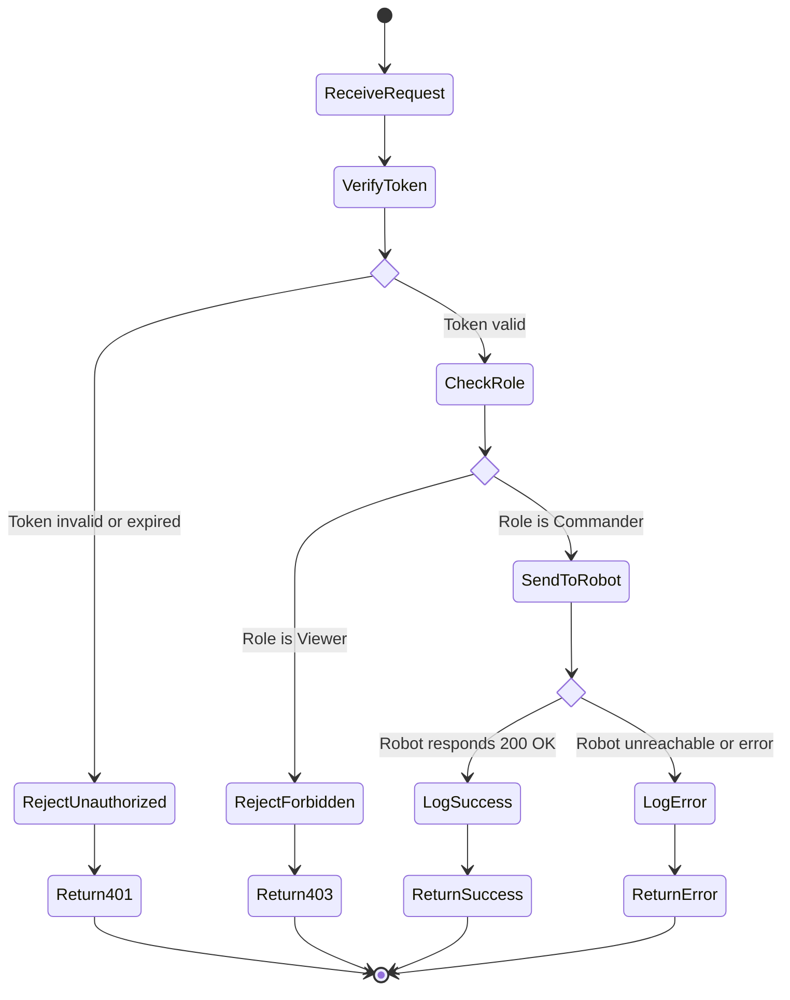

# Activity Diagram — Move Robot Authorization Flow

This diagram models the business logic executed when a user
attempts to send a move command to the robot.

## Flow Description

1. Request received at `POST /api/move/secure`
2. Token is verified using HMAC signature check
3. If invalid → 401 Unauthorized returned immediately
4. If valid → user role is checked
5. If Viewer → 403 Forbidden returned
6. If Commander → move command sent to Virtual Robot API
7. If robot responds → success logged to mission log
8. If robot unreachable → error logged to mission log
9. Response returned to client