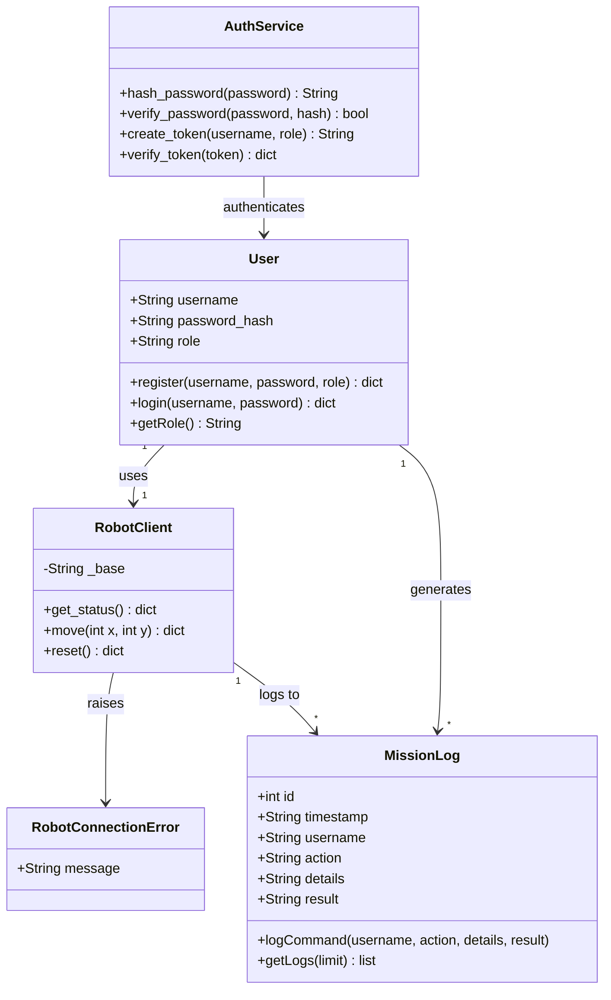

# Class Diagram — Ground Control Station Backend

This diagram defines the Object-Oriented architecture of the
backend, showing classes, attributes, methods and relationships.

## Class Descriptions

| Class | Responsibility |
|---|---|
| User | Represents an authenticated system user with a role |
| RobotClient | Facade pattern — wraps all HTTP calls to robot API |
| MissionLog | Audit trail — every command stored with timestamp and user |
| RobotConnectionError | Custom exception for robot communication failures |
| AuthService | Handles password hashing and HMAC token management |