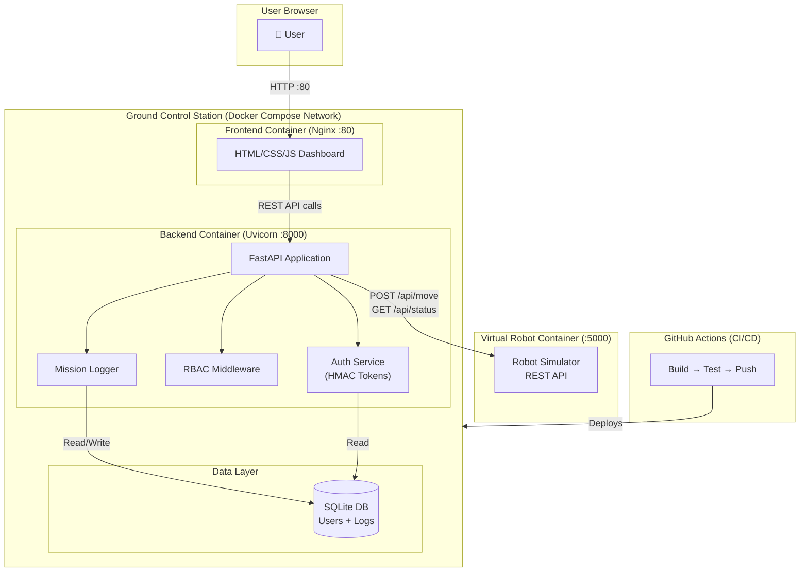

# Component Diagram — System Architecture

This high-level diagram shows how all system components connect
and communicate across the Docker network.

## Component Responsibilities

| Component | Technology | Responsibility |
|---|---|---|
| Frontend | HTML/CSS/JS + Nginx | User interface, login, grid display |
| Backend | FastAPI + Uvicorn | API routes, RBAC, business logic |
| Auth Service | Python (HMAC) | Token creation and verification |
| Mission Logger | Python + SQLite | Audit trail of all commands |
| Database | SQLite | Persistent storage of users and logs |
| Robot Simulator | Docker container | Virtual robot REST API |
| CI/CD Pipeline | GitHub Actions | Automated testing and delivery |