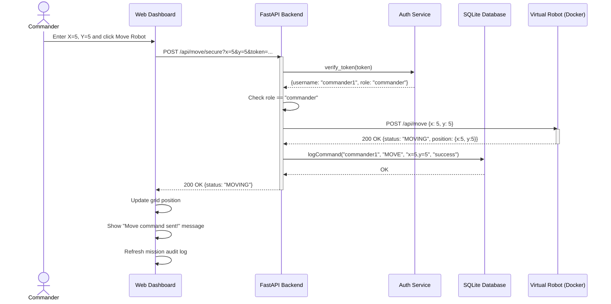
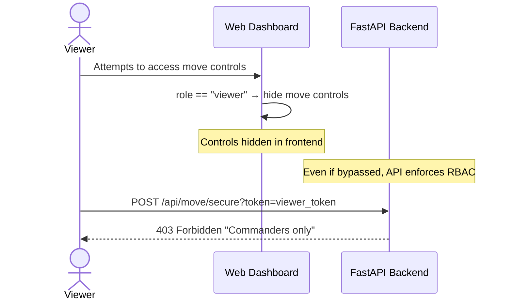

# Sequence Diagram — Move Robot Command Flow

This diagram traces the chronological execution of a move command
from the Commander through the full system stack.

## Alternative Flow — Viewer Attempts Move

