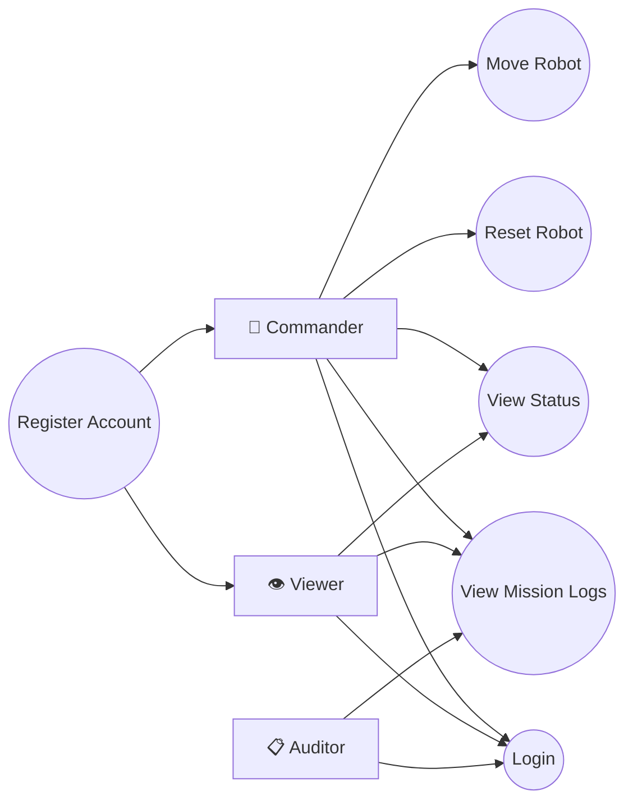

# Use Case Diagram — Ground Control Station

This diagram maps all system actors to their permitted actions,
reflecting the Role-Based Access Control (RBAC) requirements.

## Actor Descriptions

| Actor | Role | Permissions |
|---|---|---|
| Commander | Full control operator | Move robot, Reset robot, View status, View logs |
| Viewer | Read-only observer | View status, View logs only |
| Auditor | Safety auditor | View mission logs only |

## Key RBAC Rules
- Only **Commanders** can send move or reset commands
- **Viewers** receive a 403 Forbidden if they attempt to move the robot
- All roles must authenticate before accessing any feature
- Unauthenticated requests receive a 401 Unauthorized response